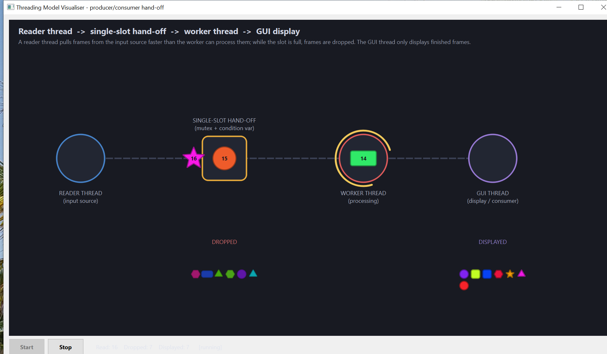

# Architecture

`ThreadingViz` (concurrency-01) visually animates a **single-slot, condition-variable
hand-off** between a producer and a consumer thread. The design goal: **the GUI thread
never blocks** — a dedicated reader thread produces frames and a worker thread processes
them, while the GUI only paints what the worker reports.



## Threading model

```
  READER thread  ──►  [ single slot ]  ──►  WORKER thread  ──►  GUI thread
  (input source)      (mutex + condvar)     (processing)        (display)
       produces        drops if full         decodes            consumes
```

| Object | Thread | Responsibility |
| --- | --- | --- |
| [`FramePipeline`](src/FramePipeline.cpp) reader loop | its own `std::thread` | pull frames from the input source, post into the single slot |
| single hand-off slot | shared (`std::mutex` + `std::condition_variable`) | hold exactly one frame; drop the newest if still full |
| [`FramePipeline`](src/FramePipeline.cpp) worker loop | its own `std::thread` | sleep on the CV, take the slot frame, process it, hand to the GUI |
| [`Canvas`](src/Canvas.cpp) | GUI thread | animate tokens, paint stations/piles — consumer only |

The backbone ([`FramePipeline.h`](src/FramePipeline.h) / [`FramePipeline.cpp`](src/FramePipeline.cpp))
contains **no GUI code** — it only knows about `Frame` and emits Qt signals delivered to the
GUI with `Qt::QueuedConnection`.

## Data flow for one frame

```
reader thread: read frame (sleep)        ── off the GUI thread
  → slot full?  yes → DROP newest        ── freshness over completeness
                no  → post into slot, notify CV
worker thread: wait on CV → take frame → process (sleep, outside the lock)
  → emit frameReady()                    ── queued signal → GUI thread
GUI thread: animate token → DISPLAYED pile
```

## Outcomes

| Outcome | Where it happens | Pile |
| --- | --- | --- |
| **Displayed** | worker finished it and handed it to the GUI | `DISPLAYED` (full alpha) |
| **Dropped** | read while the slot was still full → newest dropped | `DROPPED` (dimmed) |

## Correctness notes

* **Cooperative shutdown**: set the stop flag under the mutex, `notify_all()`, then `join()`
  both threads — no thread is killed mid-frame.
* **Cross-thread signal ordering**: the reader's `frameAccepted` and the worker's
  `processingStarted` / `frameReady` come from *different* threads and can arrive at the GUI
  out of order. `Canvas` parks the furthest-announced stage in a map and fast-forwards the
  token when the spawn signal finally arrives — see the README's concurrency section.

The console distillation this visualises is [`src/producer-consumer-cv.cpp`](src/producer-consumer-cv.cpp).
