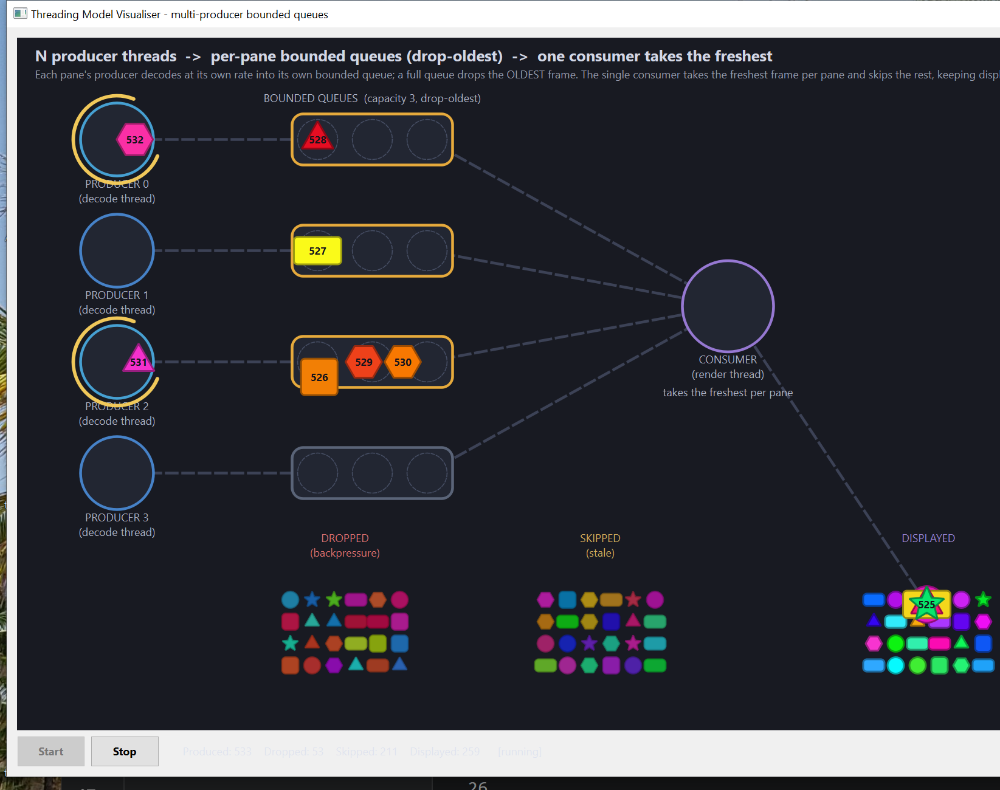

# Architecture

`ThreadingViz` (concurrency-02) visually animates **multiple producers feeding their own
bounded queues**, drained by a single consumer that keeps only the freshest frame per pane.
The design goal: fast producers can never block, grow memory without bound, or stall the
consumer — and the GUI thread only paints.



## Threading model

```
  PRODUCER 0 ──► [ bounded queue 0 ] ─┐
  PRODUCER 1 ──► [ bounded queue 1 ] ─┤
  PRODUCER 2 ──► [ bounded queue 2 ] ─┼──► CONSUMER ──► displayed
  PRODUCER 3 ──► [ bounded queue 3 ] ─┘   (render loop)
        (decode threads)                   (one thread)
```

| Object | Thread | Responsibility |
| --- | --- | --- |
| [`QuadPipeline`](src/QuadPipeline.cpp) producer N | one `std::thread` per pane | generate `Frame`s at its own cadence, push into its own queue |
| `BoundedFrameQueue` (capacity 3) | shared (`std::mutex` + `std::deque`, one per pane) | hold frames; on overflow, **drop the OLDEST** (drop-oldest backpressure) |
| [`QuadPipeline`](src/QuadPipeline.cpp) consumer | one `std::thread` (render loop) | poll each queue, take the **freshest** frame, skip staler ones |
| [`Canvas`](src/Canvas.cpp) | GUI thread | animate tokens, paint stations/piles — consumer only |

The backbone ([`QuadPipeline.h`](src/QuadPipeline.h) / [`QuadPipeline.cpp`](src/QuadPipeline.cpp))
contains **no GUI code** — it only knows about `Frame` and emits Qt signals delivered with
`Qt::QueuedConnection`.

## Data flow for one frame

```
producer N (own thread): generate frame (paced)
  → queue full?  yes → evict OLDEST (DROPPED)   ── bounded memory, never blocks
                 no  → push
consumer tick: for each queue, popLatest()      ── take newest, skip stale (SKIPPED)
  → emit frameDisplayed()                       ── queued signal → GUI thread
GUI thread: animate token → DISPLAYED pile
```

## Outcomes

| Outcome | Where it happens | Pile |
| --- | --- | --- |
| **Displayed** | consumer took it as the freshest in its pane | `DISPLAYED` (full alpha) |
| **Dropped** | evicted by drop-oldest when its queue was full | `DROPPED` (dimmed) |
| **Skipped** | consumer bypassed it as stale | `SKIPPED` (dimmed) |

## Correctness notes

* **Cooperative shutdown**: set an atomic stop flag, then `join()` every producer and the
  consumer **before** the queues are destroyed — no producer outlives the queue it writes to.
* The GUI thread mirrors per-thread signals and reconciles cross-thread arrival order so a
  token is never stranded — see the README's concurrency section.

The console distillation this visualises is [`src/multi-producer-bounded-queue.cpp`](src/multi-producer-bounded-queue.cpp).
