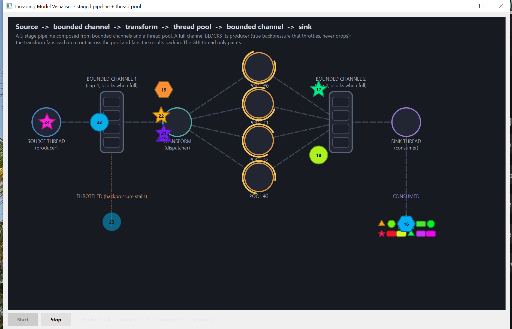

# Threading Model Visualiser — Staged Pipeline + Thread Pool

<!-- VIDEO -->
<!-- ^ Demo screen-capture goes here: drag a .mp4/.gif into the GitHub editor, or link a release asset. -->


A Qt 6 desktop app that **visually animates a real multithreading model**: a 3-stage
pipeline built from two reusable concurrency primitives — a **bounded channel** (a blocking
queue with backpressure) and a **thread pool**. A source thread emits work items through a
bounded channel to a transform thread, which fans each item out across a pool of worker
threads and fans the results back in through a second bounded channel to a sink. The threading
is genuine `std::thread` / `std::mutex` / `std::condition_variable` / `std::atomic` code — the
GUI only *paints* what the worker threads report.

It is the visual analogue of a small console program
([`staged-pipeline-threadpool.cpp`](src/staged-pipeline-threadpool.cpp)) that distils the
"senior concurrency" checklist: a blocking MPMC channel with two condition variables, a
`std::future`-returning thread pool, and a coordinated pipeline with deterministic,
stage-by-stage shutdown.



> See [`ARCHITECTURE.md`](ARCHITECTURE.md) for the threading-model diagram and data flow.

---

## The threading model

```
  SOURCE ──►[ channel 1 ]──► TRANSFORM ──►┌─ POOL #0 ─┐──►[ channel 2 ]──► SINK
 (producer)  cap 4, blocks   (dispatcher)  │  POOL #1  │   cap 4, blocks   (consumer)
              when full        fan-out ───► │  POOL #2  │ ───► fan-in        consumes
                                            └─ POOL #3 ─┘
```

* **SOURCE** — one `std::thread` emitting `WorkItem`s. It pushes each into **bounded channel
  1**. When that channel is full, `push()` **blocks** — genuine *backpressure*. The source is
  throttled to the speed the rest of the pipeline can sustain; it is **never dropped and never
  buffers without bound**.
* **Bounded channel 1** (`std::mutex` + **two** `std::condition_variable`s — *not-full* and
  *not-empty*). A full channel blocks producers; an empty channel blocks consumers; `close()`
  wakes everyone for a clean end-of-stream.
* **TRANSFORM** — one `std::thread` (the dispatcher). It pops items from channel 1 and
  `submit()`s each to the **thread pool**, getting back a `std::future`. It batches in-flight
  futures, then drains them in order and pushes the finished items into **bounded channel 2**.
* **Thread pool** — a fixed pool of **4 worker threads**. `submit()` wraps the callable in a
  `std::packaged_task` and returns a `std::future<R>` so results compose. Idle workers sleep
  on a condition variable (0% CPU). Shutdown **drains the queued tasks, then joins** every
  worker.
* **Bounded channel 2** — same primitive between transform and sink, so the *transform* feels
  backpressure too if the sink falls behind.
* **SINK** — one `std::thread` (the consumer). It pops finished items from channel 2 until the
  stream ends. **The GUI thread only paints** — it never produces and is never blocked.
* **Cooperative, deterministic shutdown**: set the stop flag, `close()` channel 1 (which wakes
  the source blocked in `push()` and the transform blocked in `pop()`), then `join()` the
  source, transform and sink **in flow order**; closing each channel cascades end-of-stream
  downstream. The **pool is shut down last**, after the transform has joined, so its in-flight
  tasks finish — **no thread is ever killed mid-work**.

The whole backbone lives in [`PipelineEngine.h`](src/PipelineEngine.h) /
[`PipelineEngine.cpp`](src/PipelineEngine.cpp) (the `BoundedChannel<T>` and `ThreadPool` primitives
are plain C++17 and know nothing about Qt). It contains **no GUI/painting code** — it only
knows about `WorkItem` and emits Qt signals.

### Outcomes

| Outcome        | Where it happens                                              | Pile (visual)             |
|----------------|--------------------------------------------------------------|---------------------------|
| **Consumed**   | flowed all the way through and was pulled by the sink        | `CONSUMED` (full alpha)   |
| **Throttled**  | the source's `push()` blocked on a full channel (backpressure) | `THROTTLED` (dimmed)    |

> Unlike a drop-queue, this model **never discards** an item. A "throttle stall" is not a lost
> item — it is the moment the source was *made to wait*. The same item still flows through and
> ends up in `CONSUMED`; the dim marker in `THROTTLED` just records that backpressure happened.

---

## How the visualisation maps to the model

| Model concept                       | Visual element                                                       |
|-------------------------------------|----------------------------------------------------------------------|
| source / transform / sink thread    | a **station** circle with a two-line label                           |
| each of the 4 pool worker threads   | its own **POOL #n** station, fanned out vertically                   |
| a work item                         | a coloured **shape token** with a small id badge                     |
| a bounded channel (cap 4)           | a **holding box** with 4 slots; filled slots glow **amber**, and the box outline turns amber when **full** |
| a pool worker running a task        | a rotating yellow **270° arc** ring around that worker, and the token **pulses** (radius wobble) |
| source throttled by backpressure    | the source station turns **red** ("BLOCKED on full channel")         |
| an outcome                          | the token flies to a labelled **pile** (6-column grid of mini-shapes)|

Every item is one of six shapes — circle, square, rectangle, star, triangle, hexagon — each in
its own vivid random colour. Tokens move along dashed flow lines at ~60 fps using an
`easeInOut` interpolation. A **watchable delay** (hundreds of ms, not the skeleton's tens of
ms) keeps everything legible.

### File layout (one class per pair, `AUTOMOC` on)

| File | Responsibility |
|------|----------------|
| [`Shapes.h`](src/Shapes.h) / [`Shapes.cpp`](src/Shapes.cpp) | the `WorkItem` item, `ShapeKind` enum, and the `paintShape()` primitive (shared by tokens and piles) |
| [`Token.h`](src/Token.h) | the animated-token struct, its state machine, and **all station/pile/channel anchor points** for this topology |
| [`PipelineEngine.h`](src/PipelineEngine.h) / [`PipelineEngine.cpp`](src/PipelineEngine.cpp) | the **threading backbone** — `BoundedChannel<T>`, `ThreadPool`, the source/transform/sink threads, signals; no GUI |
| [`Canvas.h`](src/Canvas.h) / [`Canvas.cpp`](src/Canvas.cpp) | the animation loop + painting; owns the engine; the GUI thread (a pure consumer) |
| [`MainWindow.h`](src/MainWindow.h) / [`MainWindow.cpp`](src/MainWindow.cpp) | window, Start/Stop buttons, live stats label |
| [`main.cpp`](src/main.cpp) | entry point |

Supporting files: [`CMakeLists.txt`](CMakeLists.txt) (cross-platform build, Qt 6 **or** Qt 5),
[`run.ps1`](run.ps1) / [`run.sh`](run.sh) (Windows / Unix launchers),
and [`staged-pipeline-threadpool.cpp`](src/staged-pipeline-threadpool.cpp) (the console skeleton
this app visualises).

---

## How the GUI stays correct under concurrency

The GUI thread must **only paint** and must never be blocked by, or race with, the worker
threads. Several deliberate choices make that safe.

### 1. The GUI is a consumer, never a participant

The source, transform, pool and sink threads never touch widgets. They emit Qt signals
delivered with **`Qt::QueuedConnection`** (see the `connect(...)` calls in `Canvas::start()`),
so every cross-thread notification is marshalled into a `QMetaCallEvent` and handled on the GUI
thread's event loop. The painting code reads only GUI-thread-owned state.

### 2. The custom type crossing threads is registered

`WorkItem` travels through queued signals, so it is declared with
`Q_DECLARE_METATYPE(WorkItem)` in [`Shapes.h`](src/Shapes.h) and registered with
`qRegisterMetaType<WorkItem>("WorkItem")` in the `PipelineEngine` constructor. Without this,
queued delivery of a `WorkItem` would assert at runtime.

### 3. Shutdown joins, it never kills

`Canvas::stop()` calls `PipelineEngine::shutdown()`, which sets the stop flag, `close()`s
channel 1, then `join()`s the source, transform and sink in flow order, and finally drains and
joins the **pool last**. Each thread finishes the step it is on first, and the in-flight pool
tasks complete — so Stop returns in at most one work delay and no item is ever abandoned
half-done. After the joins, `processEvents()` drains any late queued signals before the engine
is deleted.

### 4. The heavy work happens off the channels' locks

The per-item compute (`sleep_for`; in a real system, the actual transform) runs **inside the
pool task**, never while holding a channel mutex. The channels only ever serialise on the brief
enqueue/dequeue, and the four pool workers run their tasks **genuinely in parallel** (watch up
to four arcs spin at once).

---

## The concurrency pitfall this app fixes (cross-thread signal ordering)

> Symptom: occasionally a token would sail into a channel or a worker and **never leave** — a
> ghost item stranded on screen while later items piled up behind it.

This was **not** a bug in the threading core. It was a bookkeeping bug in the GUI's *mirror* of
the pipeline, caused by an ordering guarantee that Qt does **not** make.

### Why it happens

A single item's token is driven by signals coming from **many different threads**:

* `itemProduced(item)` → spawn the token at the source (emitted by the **source** thread)
* `transformTook(id)` → advance to the dispatcher (emitted by the **transform** thread)
* `workerStarted(id, n)` → advance to pool worker *n* (emitted by a **pool worker** thread)
* `resultBuffered(id, n)` → advance to channel 2 (emitted by the **transform** thread)
* `itemConsumed(item)` → advance to the consumed pile (emitted by the **sink** thread)

Qt guarantees queued events are delivered **in order per sender thread**, but gives **no
ordering guarantee between different sender threads**. So an item that flies through a fast,
nearly-empty pipeline can have its *downstream* signals (from the transform/pool/sink threads)
posted to the GUI queue **before** the source thread even gets to post `itemProduced` for it:

```cpp
// source thread                          // transform / pool / sink threads
m_chan1.push(item);                        //  (item already in the channel)
// ... source preempted RIGHT HERE ...
                                           m_chan1.pop();  emit transformTook(id);   // posted FIRST
                                           pool runs it;   emit workerStarted(id,n);  // posted FIRST
emit itemProduced(item);                   // posted only now, SECOND
```

A naive handler for `transformTook(id)` would look for the token, find nothing (it has not
spawned yet), and silently do nothing — and when `itemProduced` finally spawned the token, the
advance signals were already gone. The token would be stranded forever.

### The fix — park out-of-order advances, then fast-forward

Implemented in [`Canvas.cpp`](src/Canvas.cpp) / [`Canvas.h`](src/Canvas.h):

* A map `std::unordered_map<int, PendingStage> m_pending` parks the **furthest stage** announced
  for an item whose token has not spawned yet (carrying the pool-worker index where relevant),
  instead of dropping it:

  ```cpp
  void Canvas::onWorkerStarted(int id, int worker) {
      m_workerBusy[worker] = true;
      if (!advanceToWorker(id, worker))     // token not spawned yet?
          m_pending[id] = {StStarted, worker};  //   remember it reached the pool
  }
  ```

* `onItemProduced` checks that map first. If an advance is already waiting, it spawns the token
  and **fast-forwards it straight to the stage already reached** instead of into channel 1:

  ```cpp
  auto it = m_pending.find(item.id);
  if (it != m_pending.end()) {
      fastForward(tok, it->second);    // route to transform / worker / chan2 / sink
      m_pending.erase(it);
      m_tokens.push_back(tok);
      return;                          // never enters the channel-1 mirror
  }
  ```

* The advance handlers were factored into `advanceToTransform` / `advanceToWorker` /
  `advanceToChan2` / `advanceToSink` (each returns `false` when the token is not known yet),
  and the map is cleared in `start()`.

The result: **every** produced item has its outcome applied exactly once, regardless of the
order in which the source, transform, pool and sink signals reach the GUI. No token can be
stranded, and the on-screen channel occupancy is provably bounded to its real capacity.

---

## Build & run

The project is **OS-independent** — the same sources build and run on Windows, Linux and
macOS. The code is plain C++17 (`std::thread` / `std::mutex` / `std::condition_variable` /
`std::future` / `std::atomic`) plus Qt Widgets, and uses `M_PI` from `<QtMath>` so there are no
platform `#ifdef`s. The [`CMakeLists.txt`](CMakeLists.txt) auto-detects **Qt 6 or Qt 5**, links
the platform threading library (`pthread` on Unix), and emits a console-less `.exe` on Windows
and a proper `.app` bundle on macOS.

### Prerequisites

* **Qt 6 or Qt 5** with the *Widgets* module
* a **C++17** compiler (GCC, Clang, or MSVC)
* **CMake ≥ 3.16** (and, optionally, Ninja — any CMake generator works)

### Generic build (Linux / macOS / Windows)

Point CMake at your Qt installation with `CMAKE_PREFIX_PATH` (the directory that contains
`lib/cmake/Qt6`, e.g. `.../Qt/6.9.2/gcc_64` on Linux, `.../Qt/6.9.2/macos` on macOS,
`.../Qt/6.9.2/mingw_64` or `.../msvc2019_64` on Windows):

```bash
cmake -S . -B build -DCMAKE_BUILD_TYPE=Release -DCMAKE_PREFIX_PATH="<your-qt-kit-dir>"
cmake --build build
```

The resulting binary is `build/PipelineViz` on Linux, `build/PipelineViz.app` on macOS, and
`build/PipelineViz.exe` on Windows. If Qt came from a system package (e.g. `apt install
qt6-base-dev` or `brew install qt`), you can usually omit `CMAKE_PREFIX_PATH` entirely.

### Windows (Qt MinGW kit)

Replace the example paths below with **your own** Qt installation directories:

```powershell
$qt    = "C:\Qt\6.9.2\mingw_64"           # <-- your Qt kit
$mingw = "C:\Qt\Tools\mingw1310_64\bin"   # <-- your MinGW
$ninja = "C:\Qt\Tools\Ninja"
$env:PATH = "$qt\bin;$mingw;$ninja;$env:PATH"

cmake -S . -B build -G Ninja -DCMAKE_BUILD_TYPE=Release `
      -DCMAKE_PREFIX_PATH="$qt" -DCMAKE_CXX_COMPILER="$mingw\g++.exe"
cmake --build build

# Deploy the Qt runtime DLLs next to the exe (once):
& "$qt\bin\windeployqt.exe" build\PipelineViz.exe
```

A convenience launcher [`run.ps1`](run.ps1) is included; it reads optional `QT_DIR` /
`MINGW_DIR` environment variables (falling back to documented defaults), puts the Qt runtime on
`PATH`, and launches the exe.

### Linux / macOS

After the generic build above, use the included [`run.sh`](run.sh) (first make it executable):

```bash
chmod +x run.sh          # once
./run.sh                 # or: QT_DIR=~/Qt/6.9.2/gcc_64 ./run.sh
```

It adds `$QT_DIR/lib` to the loader path when set, then launches `build/PipelineViz` (Linux) or
opens `build/PipelineViz.app` (macOS). To bundle Qt for distribution, use
[`macdeployqt`](https://doc.qt.io/qt-6/macos-deployment.html) on macOS or
[`linuxdeployqt`](https://github.com/probonopd/linuxdeployqt) / an AppImage on Linux.

### Using it

Press **Start** to launch the source, transform, sink and the worker pool; **Stop** flags +
joins them cleanly (it stays disabled until started). The stats line shows live **Produced /
Throttle stalls / Consumed** counts.

### Continuous integration

CI lives at the repository root — [`/.github/workflows/build.yml`](../.github/workflows/build.yml)
builds this project together with the other three on Ubuntu, Windows and macOS on every push/PR
and smoke-tests the binary headlessly on Linux. The build badge is in the
[collection README](../README.md).

---

## Tuning

The cadences that make the backpressure behaviour visible live at the bottom of
[`Canvas.h`](src/Canvas.h):

```cpp
static constexpr int kSourceMs = 240;   // source produce cadence
static constexpr int kWorkMs   = 900;   // heavy per-item processing on the pool
```

Because the source produces faster than a 4-worker pool can clear a full batch, the transform
periodically pauses to drain its in-flight futures; while it does, channel 1 fills and the
source is forced to wait — a **throttle stall**. Raise `kWorkMs` (or lower `kSourceMs`) for more
frequent backpressure; bring them closer together to see the channels drain cleanly.

Other knobs:

* **Pool size & channel capacity** — `kPoolSize` and `kChannelCap` in [`Token.h`](src/Token.h)
  (used by both the engine and the layout, so the picture always matches the threads).
* **Transform batch size** — `kInflightCap` in [`PipelineEngine.cpp`](src/PipelineEngine.cpp)
  controls how many futures the transform batches before draining; smaller batches make
  channel-1 backpressure more frequent.
* **Station / pile / channel coordinates** — all in [`Token.h`](src/Token.h).
