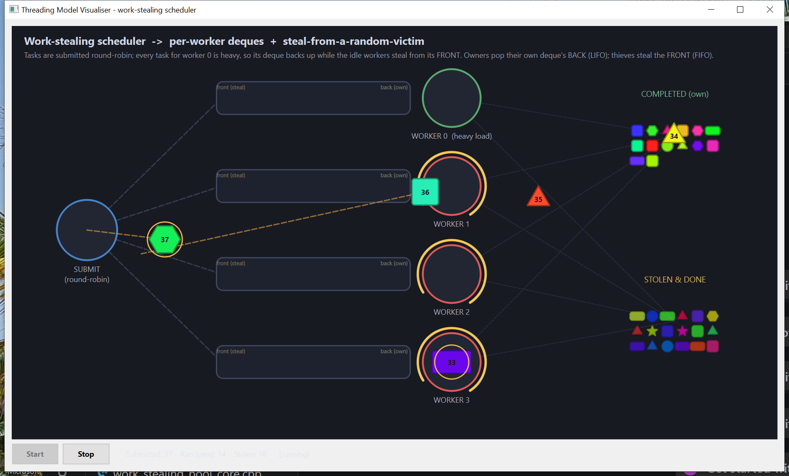

# Threading Model Visualiser — Work-Stealing Scheduler

<!-- VIDEO -->
<!-- ^ Demo screen-capture goes here: drag a .mp4/.gif into the GitHub editor, or link a release asset. -->


A Qt 6 desktop app that **visually animates a real multithreading model**: a work-stealing
thread pool. Each worker owns its own double-ended queue (deque); it runs its own tasks
LIFO-style and, when idle, **steals** work from a random busy worker's deque. The threading is
genuine `std::thread` / `std::mutex` / `std::condition_variable` / `std::atomic` code — the GUI
only *paints* what the worker threads report.

It is the visual analogue of a small console program
([`work_stealing_pool_core.cpp`](src/work_stealing_pool_core.cpp)) that distils the architecture
behind real schedulers (Intel TBB, the Go runtime, Rust Rayon/Tokio): per-worker deques plus
steal-from-a-random-victim, so idle cores pull work from busy ones instead of all contending on
one central queue.



> See [`ARCHITECTURE.md`](ARCHITECTURE.md) for the threading-model diagram and data flow.

---

## The threading model

```
                       ┌─► WORKER 0 deque ─► WORKER 0  (heavy load)
  SUBMIT  ─round-robin─┤   WORKER 1 deque ─► WORKER 1 ─┐
  (one thread)         │   WORKER 2 deque ─► WORKER 2  ├─ an idle worker STEALS from
                       └─► WORKER 3 deque ─► WORKER 3 ─┘  a random victim's FRONT
        push BACK ──────────────────┘            └────────► run, then complete
```

* **One submitter thread** distributes tasks **round-robin** across the workers' deques
  (`pushBack`). Every task whose home is **worker 0** is heavy, so worker 0's deque steadily
  **backs up** while the others stay light — the imbalance the scheduler must fix.
* **N worker threads** (4 here), each owning **its own deque** (`std::deque` + a `std::mutex`):
  * It drains **its own** deque from the **BACK** — `popBack`, **LIFO**, cache-friendly and
    contention-free in the common case.
  * When its deque is **empty** it becomes a **thief**: it `stealFront`s a task from the
    **FRONT** of a **random victim's** deque — **FIFO**, the opposite end from the owner, so the
    two rarely touch the same element.
* **An idle worker sleeps on a shared condition variable** (`m_wake`) until a submit wakes it —
  no busy-spin; an idle pool uses ~0% CPU.
* **The GUI thread only consumes.** Workers emit Qt signals (queued) that the GUI turns into
  animated shapes; it never schedules and is never blocked.
* **Cooperative, deterministic shutdown**: set the stop flag, wake everyone, let the workers
  **drain whatever is still pending**, then `join()` the submitter and every worker. No task in
  flight is ever abandoned mid-run.

All of this lives in [`WorkStealingPool.h`](src/WorkStealingPool.h) /
[`WorkStealingPool.cpp`](src/WorkStealingPool.cpp) and contains **no GUI/painting code** — it only
knows about `Task` and emits Qt signals.

### Two outcomes for a task

| Outcome     | Where it happens                                         | Pile (visual)                |
|-------------|----------------------------------------------------------|------------------------------|
| **Ran (own)** | a worker popped it from **its own** deque's back       | `COMPLETED (own)` (full alpha) |
| **Stolen**  | an idle worker **stole** it from another worker's front  | `STOLEN & DONE` (dimmed)     |

Both outcomes are *successful completions* — the dimmed `STOLEN` pile simply distinguishes the
work that had to be rebalanced. Because worker 0 hoards the heavy tasks, the **stolen** pile
typically fills faster than the own pile: that *is* the work-stealing lesson, made visible.

---

## How the visualisation maps to the model

| Model concept                       | Visual element                                                          |
|-------------------------------------|-------------------------------------------------------------------------|
| submitter / worker thread           | a **station** circle with a label                                       |
| a task                              | a coloured **shape token** with a small id badge                        |
| a heavy task (home = worker 0)      | a token drawn slightly larger with a thin **amber ring**                |
| a worker's deque                    | a **lane** to its left: `front (steal)` end on the left, `back (own)` on the right |
| a worker actively running a task    | a rotating yellow **270° arc** ring (station turns red)                 |
| a worker idle / sleeping on the CV  | a green station, no arc                                                  |
| running a task                      | the token **pulses** (radius wobble) at the worker                       |
| a steal in flight                   | the token crosses rows on a highlighted **amber dashed** line           |
| an outcome                          | the token flies to a labelled **pile** (6-column grid of mini-shapes)   |

Every task is one of six shapes — circle, square, rectangle, star, triangle, hexagon — each in
its own vivid random colour. Tokens move along dashed flow lines at ~60 fps using an `easeInOut`
interpolation; queued tokens **home** toward their slot so the deque visibly compacts as tasks
are popped or stolen. A **watchable delay** (hundreds of ms, not the skeleton's tens) keeps
everything legible.

### File layout (one class per pair, `AUTOMOC` on)

| File | Responsibility |
|------|----------------|
| [`Shapes.h`](src/Shapes.h) / [`Shapes.cpp`](src/Shapes.cpp) | the `Task` item, `ShapeKind` enum, and the `paintShape()` primitive (shared by tokens and piles) |
| [`Token.h`](src/Token.h) | the animated-token struct, its state machine, and **all station/deque/pile anchor points** for this topology |
| [`WorkStealingPool.h`](src/WorkStealingPool.h) / [`WorkStealingPool.cpp`](src/WorkStealingPool.cpp) | the **threading backbone** — the submitter + worker threads, per-worker deques, stealing, signals; no GUI |
| [`Canvas.h`](src/Canvas.h) / [`Canvas.cpp`](src/Canvas.cpp) | the animation loop + painting; owns the pool; the GUI thread (a pure consumer) |
| [`MainWindow.h`](src/MainWindow.h) / [`MainWindow.cpp`](src/MainWindow.cpp) | window, Start/Stop buttons, live stats label |
| [`main.cpp`](src/main.cpp) | entry point |

Supporting files: [`CMakeLists.txt`](CMakeLists.txt) (cross-platform build, Qt 6 **or** Qt 5),
[`run.ps1`](run.ps1) / [`run.sh`](run.sh) (Windows / Unix launchers),
and [`work_stealing_pool_core.cpp`](src/work_stealing_pool_core.cpp) (the console skeleton this app
visualises).

---

## How the GUI stays correct under concurrency

The GUI thread must **only paint** and must never be blocked by, or race with, the worker
threads. Several deliberate choices make that safe.

### 1. The GUI is a consumer, never a participant

The submitter and worker threads never touch widgets. They emit Qt signals delivered with
**`Qt::QueuedConnection`** (see the `connect(...)` calls in `Canvas::start()`), so every
cross-thread notification is marshalled into a `QMetaCallEvent` and handled on the GUI thread's
event loop. The painting code reads only GUI-thread-owned state (`m_tokens`, the deque mirror,
the piles).

### 2. The custom type crossing threads is registered

`Task` travels through queued signals, so it is declared with `Q_DECLARE_METATYPE(Task)` in
[`Shapes.h`](src/Shapes.h) and registered with `qRegisterMetaType<Task>("Task")` in the
`WorkStealingPool` constructor. Without this, queued delivery of a `Task` would assert at runtime.

### 3. Each deque is mutex-guarded; the slow work happens outside the lock

Every `pushBack` / `popBack` / `stealFront` takes that deque's own mutex only for the brief
list operation. The task's actual work (`sleep_for`, sized by cost) runs in `runTask`
**after** the element has left the deque — owners and thieves serialise only on the tiny
enqueue/dequeue, never on the expensive stage. The atomics (`m_pending`, `m_ran`, `m_stolen`,
the round-robin cursor) carry the cross-worker bookkeeping without a global lock.

### 4. Shutdown drains, then joins — it never kills

`Canvas::stop()` calls `WorkStealingPool::shutdown()`, which flags `m_stopping`, `notify_all()`s
the wake CV, joins the **submitter** (so no new work appears), then joins **every worker**. A
worker only returns once `m_stopping` is set **and** `m_pending == 0`, so the backlog is drained
(idle workers keep stealing during shutdown) before anyone exits. After the join,
`processEvents()` drains any late queued signals before the pool is deleted.

---

## The concurrency pitfall this app fixes (cross-thread signal ordering)

> Symptom: occasionally a token would arrive in a deque lane and **never leave** — a ghost task
> stranded in a queue whose real copy had long since been run.

This was **not** a bug in the threading core. It was a bookkeeping bug in the GUI's *mirror* of
the pool, caused by an ordering guarantee that Qt does **not** make.

### Why it happened

The token for a task is driven by signals coming from **two different threads**:

* `taskSubmitted(t)` → spawn the token in its home deque (emitted by the **submitter** thread)
* `taskStarted(t, w, …)` / `taskFinished(t, w, …)` → move the token to the worker, then to a
  pile (emitted by a **worker** thread)

Qt guarantees queued events are delivered **in order per sender thread**, but gives **no ordering
guarantee between two different sender threads**. So this interleaving is possible:

```cpp
// submitter thread                         // a worker thread
m_deques[home]->pushBack(t);   // task X visible to workers
m_wake.notify_all();
            // ... submitter preempted RIGHT HERE, before it emits ...
                                            // wakes, steals X, runs it:
                                            emit taskStarted(X, w, true);   // posted FIRST
                                            emit taskFinished(X, w, true);  // posted SECOND
emit taskSubmitted(X);                      // posted only now, THIRD
```

The GUI therefore processed the *advance* signals **before** the *spawn*: `onTaskStarted(X)` and
`onTaskFinished(X)` looked for X's token, found nothing, and did nothing; then
`onTaskSubmitted(X)` spawned X into its deque lane. Its start/finish were already gone, so the
token sat in the lane **forever**. (`taskStarted` and `taskFinished` share one sender — the
worker that ran X — so they keep their relative order; only `taskSubmitted` can arrive late.)

### The fix — defer out-of-order advances

Implemented in [`Canvas.cpp`](src/Canvas.cpp) / [`Canvas.h`](src/Canvas.h):

* A small map `std::unordered_map<int, Parked> m_pending` parks the **furthest stage** announced
  for a task whose token has not spawned yet (along with *which* worker ran it and whether it was
  stolen), instead of dropping it:

  ```cpp
  void Canvas::onTaskStarted(Task t, int byWorker, bool stolen) {
      m_busy[byWorker] = true;
      if (!advanceToWorker(t.id, byWorker, stolen))   // token not spawned yet?
          m_pending[t.id] = {Parked::Started,  byWorker, stolen};
  }
  void Canvas::onTaskFinished(Task t, int byWorker, bool stolen) {
      m_busy[byWorker] = false;
      if (!advanceToPile(t.id, byWorker, stolen))
          m_pending[t.id] = {Parked::Finished, byWorker, stolen};
  }
  ```

* `onTaskSubmitted` checks that map first. If an advance is already waiting, it spawns the token
  and routes it **straight to the stage already reached** — to the worker, or all the way to the
  correct (own / stolen) pile — instead of into the deque lane:

  ```cpp
  auto it = m_pending.find(task.id);
  if (it != m_pending.end()) {
      const Parked pk = it->second;  m_pending.erase(it);
      tok.ranBy = pk.byWorker;  tok.stolen = pk.stolen;
      if (pk.stage == Parked::Finished) { tok.state = pk.stolen ? Token::ToStolenPile : Token::ToOwnPile; … }
      else                              { tok.state = Token::ToWorker; … }
      m_tokens.push_back(tok);
      return;                          // never enters the deque mirror
  }
  ```

The result: **every** submitted task has its outcome applied exactly once, regardless of the
order the submitter's and workers' signals happen to reach the GUI. No token can be stranded in
a deque lane.

---

## Build & run

The project is **OS-independent** — the same sources build and run on Windows, Linux and macOS.
The code is pure **C++23** (`std::thread` / `std::mutex` / `std::condition_variable` /
`std::atomic`) plus Qt Widgets, with **no platform `#ifdef`s** (`M_PI` comes from `<QtMath>`).
The [`CMakeLists.txt`](CMakeLists.txt) auto-detects **Qt 6 or Qt 5**, links the platform
threading library (`Threads::Threads` → pthread on Unix), and emits a console-less `.exe` on
Windows and a proper `.app` bundle on macOS.

### Prerequisites

* **Qt 6 or Qt 5** with the *Widgets* module
* a **C++23** compiler (GCC 12+, Clang 15+, or MSVC 2022)
* **CMake ≥ 3.16** (and, optionally, Ninja — any CMake generator works)

### Generic build (Linux / macOS / Windows)

Point CMake at your Qt installation with `CMAKE_PREFIX_PATH` (the directory that contains
`lib/cmake/Qt6`, e.g. `.../Qt/6.9.2/gcc_64` on Linux, `.../Qt/6.9.2/macos` on macOS,
`.../Qt/6.9.2/mingw_64` or `.../msvc2019_64` on Windows):

```bash
cmake -S . -B build -DCMAKE_BUILD_TYPE=Release -DCMAKE_PREFIX_PATH="<your-qt-kit-dir>"
cmake --build build
```

The resulting binary is `build/WorkStealingViz` on Linux, `build/WorkStealingViz.app` on macOS,
and `build/WorkStealingViz.exe` on Windows. If Qt came from a system package (e.g.
`apt install qt6-base-dev` or `brew install qt`), you can usually omit `CMAKE_PREFIX_PATH`.

### Windows (Qt MinGW kit)

Replace the example paths below with **your own** Qt installation directories:

```powershell
$qt    = "C:\Qt\6.9.2\mingw_64"           # <-- your Qt kit
$mingw = "C:\Qt\Tools\mingw1310_64\bin"   # <-- your MinGW
$ninja = "C:\Qt\Tools\Ninja"
$env:PATH = "$qt\bin;$mingw;$ninja;$env:PATH"

cmake -S . -B build -G Ninja -DCMAKE_BUILD_TYPE=Release `
      -DCMAKE_PREFIX_PATH="$qt" -DCMAKE_CXX_COMPILER="$mingw\g++.exe"
cmake --build build

# Deploy the Qt runtime DLLs next to the exe (once):
& "$qt\bin\windeployqt.exe" build\WorkStealingViz.exe
```

A convenience launcher [`run.ps1`](run.ps1) is included; it reads optional `QT_DIR` /
`MINGW_DIR` environment variables (falling back to documented defaults), puts the Qt runtime on
`PATH`, and launches the exe.

### Linux / macOS

After the generic build above, use the included [`run.sh`](run.sh) (first make it executable):

```bash
chmod +x run.sh          # once
./run.sh                 # or: QT_DIR=~/Qt/6.9.2/gcc_64 ./run.sh
```

It adds `$QT_DIR/lib` to the loader path when set, then launches `build/WorkStealingViz` (Linux)
or opens `build/WorkStealingViz.app` (macOS). If Qt is installed system-wide you can also just
run the binary directly.

### Using it

Press **Start** to launch the submitter and worker threads; **Stop** flags + drains + joins them
cleanly (it stays disabled until started). The stats line shows live **Submitted / Ran (own) /
Stolen** counts.

### Continuous integration

CI lives at the repository root — [`/.github/workflows/build.yml`](../.github/workflows/build.yml)
builds this project together with the other three on Ubuntu, Windows and macOS on every push/PR
and smoke-tests the binary headlessly on Linux. The build badge is in the
[collection README](../README.md).

---

## Tuning

The cadences that make the stealing visible live at the bottom of [`Canvas.h`](src/Canvas.h):

```cpp
static constexpr int kSubmitMs = 320;   // cadence between round-robin submits
static constexpr int kShortMs  = 550;   // cheap task duration
static constexpr int kLongMs   = 1700;  // heavy task duration (worker 0's load)
```

Worker 0 receives a heavy task roughly every `kWorkers * kSubmitMs` ms but takes `kLongMs` to
run each, so its deque backs up; meanwhile workers 1–3 burn through their cheap tasks and steal
the backlog. Raise `kLongMs` or lower `kSubmitMs` for a heavier imbalance (more stealing); bring
the durations closer together to see the deques drain evenly. The number of workers, the station
/ deque-lane / pile coordinates, and the deque slot spacing are all in [`Token.h`](src/Token.h)
(`kWorkers`, `kWorkerY[]`, `kDequeBackX`, `kDequeGap`, `kOwnPilePt`, `kStolenPilePt`).
